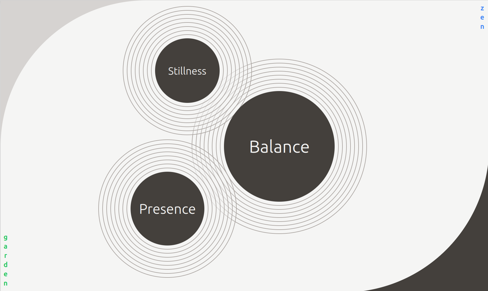
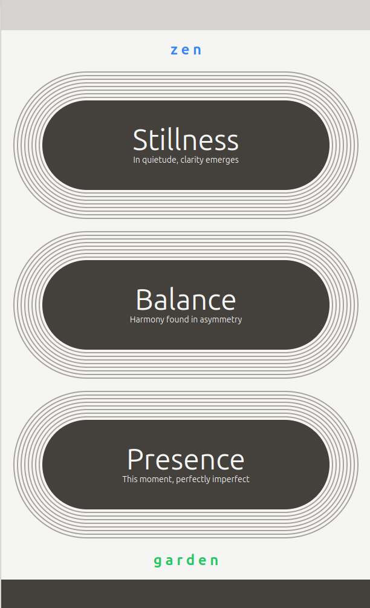

# 🪨 Zen Garden - A Tailwind CSS Meditation

Welcome to Zen Garden, where we find peace in pixels and tranquility in Tailwind.

In this lab, you'll create a **minimalist zen garden** using only HTML and Tailwind CSS. No JavaScript. No Bootstrap. Just you, some utility classes, and inner peace.

---

## 🎯 What You're Building




You're creating a meditative interface featuring:

- Stones with ripple effects (like dropping pebbles in water)
- Asymmetrical, balanced layout
- Curved background elements
- Responsive design that transforms gracefully
- Vertical text elements for that extra zen aesthetic

Your goal: **match the design's peaceful energy and visual layout**.

The solution is provided provided in case you get stuck, but only use it as a last resort. The journey is where the real learning happens. You have 3.5 hours to work on this project, so there's plenty of time to try different solutions to this challenge! Using the [Tailwind Docs](https://tailwindcss.com/docs/) to look up classes is encouraged -- it will help you get used to the documentation.

## 🎨 Color Palette

Embrace the calm with these stone-inspired colors:

```
STONE SHADES: stone-100, stone-300, stone-400, stone-700
ACCENT BLUE: blue-700
ACCENT GREEN: green-700
TRANSPARENCY: Use /20 for 20% opacity (e.g., bg-stone-100/20)
```

## 🏗 Required Elements

### 1. Background Architecture
- Curved dark sections using geometric shapes
- Layered elements with z-index
- A large light circle creating visual flow

### 2. Three Wisdom Stones
Each stone needs:
- **Ripple effect**: 8 nested circular borders (yes, 8!)
- **Different sizes**: Small (14rem), Large (24rem), Medium (16rem)
- **Positioned asymmetrically** on desktop
- **Responsive behavior**: Stack vertically on mobile

### 3. Vertical Text Elements
- "zen" in the top-right (blue)
- "garden" in the bottom-left (green)
- Individual letters stacked vertically

### 4. Content
```
Stillness: "In quietude, clarity emerges"
Balance: "Harmony found in asymmetry"
Presence: "This moment, perfectly imperfect"
```
(Hide subtitles on desktop with `md:hidden`)

## 💡 Pro Tips

- **Start with mobile**, then add `md:` prefixes for desktop styles
- **Ripples are just nested divs** with borders and padding
- **Use `rounded-full`** to make perfect circles
- **Position with `md:absolute`** and viewport units (like `top-[20vh]`)
- **Layer with z-index**: content (z-10), backgrounds (-z-10, -z-20)
- **Test responsiveness** frequently - this design transforms significantly

## 🚀 Helpful Tailwind Classes

```css
/* Positioning */
relative, absolute, top-[20vh], right-[25vw], bottom-[5vh], left-[20vw]

/* Sizing */
w-[14rem], h-[14rem], w-[50vw], h-[50vh]

/* Spacing */
p-1, p-3, m-4, gap-2

/* Flexbox/Grid */
flex, flex-col, items-center, grid, place-items-center

/* Visual */
rounded-full, border-2, bg-stone-700, text-stone-100
bg-stone-100/20 (transparency!)

/* Responsive */
md: prefix for desktop styles
```

## 🧘 Stretch Goals (Optional)

Finished early? Try building a pond section underneath the stones. Use your imagination -- maybe some floating leaves or a subtle water ripple effect.

---

Remember: In meditation, the journey is more important than the destination. Take breaks, breathe deeply, and may your CSS be ever cascading.

Happy coding! 🪨✨
